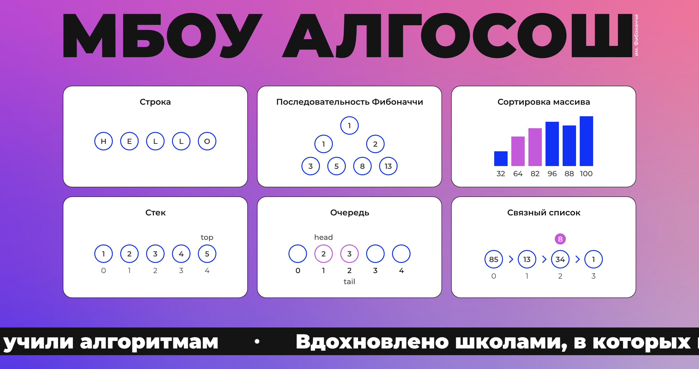

# Проектная работа. МБОУ АЛГОСОШ им. Фибоначчи

## Tech Stack


## Demo

Задеплоенное приложение: https://theverybusybee.github.io/algorithms-visualization/



## Клонирование репозитория 

```bash
$ git clone git@github.com:theverybusybee/algorithms-visualization.git
```

## Запуск приложения

### Установка зависимостей и запуск проекта

#### install dependencies
```bash
$ npm install
```

#### build project
```bash
$ npm run build
```

#### run prod mode
```bash
$ npm run start
```

#### run test
```bash
$ npm run test
```

#### run cypress e2e-tests
```bash
$ npm run cy:run
```
## Запуск приложения

Запустите [http://localhost:3000](http://localhost:3000), чтобы отобразить результат запуска.

## Description

Проектная работа по разработке и анимированию алгоритмов, страницы выполнены при помощи готовых UI-компонентов, алгоритмы покрыты тестами при помощи Jest и Сypress.

### Строка

Разворот строки

### Последовательность Фибоначчи

Генерация `n` чисел последовательности Фибоначчи. 

### Сортировка массива

Визуализация алгоритмов сортировки выбором и пузырьком

### Стек

Визуализация удаления и добавления элементов в структуру данных стек

### Очередь

Визуализация удаления и добавления элементов в структуру данных «очередь».

### Связный список

Реализация удаления и добавления элементов в связный список. 

## Links
* [Link to figma](https://www.figma.com/file/RIkypcTQN5d37g7RRTFid0/Algososh_external_link?type=design&node-id=0%3A1&mode=design&t=MoD0Zb4fiUt9c2ra-1)
